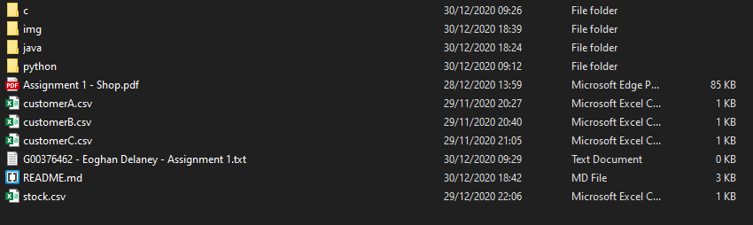
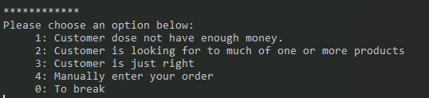
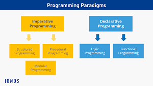

<p>
    <h1 align="center">Multi-Paradigm Programming - Shop Assignment</h1>
    <p align="center"></p>
    <h3 align="center">Student: Eoghan Delaney</h3>
    <h3 align="center">Student Number: G00376462</h3>
</p>

## Project Introduction

The aim of this project was to code a Shop, where customers can buy a number of products, in three different programming languages - C, Java and Python. The project called for two different programming paradigms, Object Orientated Programming for the Java language attempt and Procedural Programming for both the C and Python. The output from all three were to be indistinguishable from one another, to the end user.

The intended outcome of the project was to get a better understanding of the differences between the two different approaches while simultaneously learning about the three different programming languages.

The project task was to build additional functionality into a base code for each language - C, Pytohn and Java. *(Below is an extract from the assessment paper)*.

    - The shop CSV should hold the initial cash value for the shop.
    
    - Read in customer orders from a CSV file.
        - That file should include all the products they wish to buy and in what quantity
        - It should also include their name and their budget.

    - The shop must be able to process the orders of the customer.
        - Update the cash in the shop based on money received.
            - It is important that the state of the shop be consistent.
            - You should create customer test files (CSVs) which cannot be completed by the shop e.g. customer wants 400 loaves of bread but the shop only has 20, or the customer wants 2 cans of coke but can only afford 1.
            - If these files don’t exist marks penalties will be applied.
        - Know whether or not the shop can fill an order.
            - Thrown an appropriate error.

    - Operate in a live mode, where the user can enter a product by name, specify a quantity, and pay for it. The user should be able to buy many products in this way.

## Housekeeping

#### Folder Structure
Below is the folder structure layout given/modified as part of the project. As per the original, each language had its own sub-folder. Both C and Python have one file to run, however with the OOP approach Java - this is made up of multiple files. The Main load file in this directory is *"Menu"*. 

The folder structure is also made up of four number CSV files. As requested in the brief, there are three different types of customers - one with insufficient money, one requesting more stock than the shop holds and finally the third was a clean complete transaction. These files are made up of the Customers Name, Budget and shopping lists, the Quantity of each of the products wanted. The final CSV file is made up of the Stock and Cash the Shop holds.
<p align="center"></p>

#### User interface
When each application is launched the users is greeted with the below menu where the user is prompted to select one of the following options.
<p align="center"></p>

## Programming Paradigms
*'The term programming paradigm is the style or way of thinking about
and approaching problems.'* [1] When tackling a programming problem it is best to keep in mind, the computer will do exactly what is asked of it. The paradigm is the method or approach taken when giving a set of instructions to the computer. There are two main schools of thought Imperative and Declarative. 

#### Imperative & Declarative
<p align="center"></p>This image whas taken from the following source[2]

Computer hope defines Imperative programming as *'a paradigm of computer programming where the program describes steps that change the state of the computer.'* [3] while Code Burst explains Declarative as *'that expresses the logic of a computation without describing its control flow.'*[4]

The imperative approach is seen as "how" the programme works wile declarative is "what" function should it accomplish. If we look at SQL Vs Python to accomplish the same task in a small table.
```
    Filter a list of Names:
    SQL:  
        SELECT name, age FROM names WHERE name LIKE 'Stephen';

    Python:
        for name, age in names.items(): 
            if name == 'Stephen':
                print(name, age)
```
The above example shows the "how" the Python function will execute the imperative paradigm while the SQL declarative asks "what". The SQL is not giving any instructions how to carry out the task only what the user wants.

As part of this assignment we used two forms of Imperative Paradigms - Procedural (Python and C) and Object-Orientated Programming (Java). Although both are imperative approach's, they do differ.

Procedural uses a top-down linear approach giving a list of instructions in a sequential manner for the computer to follow and complete the desired result.

Object-Orientated Programming has a different approach, objects are stand alone entities of code that can interact with one another. An object is similar to a blueprint/template for the required piece of code. For the Java example in this assignment some of the Objects included a Customer, Shop or Menu. The template for the Customer remained the same however the number and contents for each Customer differs.

We will now discuss the Similarities and Differences between the two approaches.

## Analysis of Similarities & Differences
There are a number of similarities and differences between both approach's and we will discuss some of them in this section.

In procedural programming the data and the procedures/functions are separated, the data is then processed by the methods and function to perform a required outcome. The OOP method couples the relevant data with the relevant functions, that manipulate the same data. 

An example of these differences in this coding assignment included the Customer being defined in Java versus the C programming language. The Customer information in the Java approach in contained within the Customer object, this infromation can not be altered by an external object, however in the procedural approach, C and Python, the Customers data may be changed/modified if required.

The above example also highlights the difference of Security of the data. The Customers information is stored as private, in Java, to that class. However in C the Customer "struct" can be seen at the point of initialisation.

The OOP can be viewed as less complex - with the modular approach of the code, all Objects are standalone and can be viewed as so. With the procedural top-down approach it is allot more difficult to modify existing code without having to change everything, this task becomes more difficult the more functionality that is introduced. The Java (OOP) method would lend it self better if the program required further information in the Product class. Some products go on sail.

Below are a list of the four pillars of Object Orientated Programming, we can now review how they compare them with Procedural.

1. #### Abstraction
    * Abstraction is the hiding or abstracting of data or details of a process. "Drive to Cork" is an abstraction of Step 1 - Get you car keys. Step 2 - Get in the car Step 3 - Make a left out the driveway and so on.
    * Procedural: Abstraction is used in Procedural programming, an example of this the lambda abstraction, *"making a term into a function of some variable"* [12]
2. #### Encapsulation
    * Encapsulation, as discussed above, is the coupling of data and functions together.
    * Procedural: There is no data hidden in the procedural approach.
3. #### Inheritance
    * Inheritance is where an Object or Class inherits the properties of ancestor class. For example and Student inherits all the properties of a Person. All Students are people.
    * Procedural: Inheritance is not allowed. [10]
4. #### Polymorphism 
    * Polymorphism is to use a single Object for different applications. An exmple of this that was highlighted by Archy Tripathi [9]- using the "+" operator it can be used to sum ints, floats and doubles while also concatenating text.
    * Procedural: *"Procedural languages do not have polymorphism. Each function exists only once, therefore there cannot be more than one implementation with the same name, so it is not possible to swap one implementation with another."* [11]


## Conclusion
In conclusion, from reviewing a number of sources, Procedural Programming is the more straightforward to understand when starting to code. It follows a linear pattern, step by step - one after another. As I was more familiar with Python, it was clear where each elements was coming from in C.

When reviewing the OOP this was more complex. I had never used Java prior to this project. I enjoyed it. It was difficult to get to grips with the Objects and Syntax. Upon reflection if I were to undertake the Live mode of the Java element again - I would spent more time on the "processOrderAsk Class" in the "ShopA.java" file. It is an exact copy of the preceding method "processOrder". As this method takes in a customer and my "AskOrder" essentially builds a customer alongside.

I found the project challenging and enjoyable. I know feel as though i have a better understanding of types of Paradigms, Procedural PRogramming, Object Orientated Programming and now Java. 


## References
    1. Dominic Carr Lecture Notes, "Multi-Paradigm Programming - What is a Programming Paradigm?" GMIT 
    2. https://www.ionos.com/digitalguide/websites/web-development/programming-paradigms/
    3. Computer Hope, 2019 https://www.computerhope.com/jargon/i/imp-programming.htm
    4. Code Burst, Ian Mundy 2017 https://codeburst.io/declarative-vs-imperative-programming-a8a7c93d9ad2
    5. https://www.tutorialspoint.com/differences-between-procedural-and-object-oriented-programming
    6. https://softwareengineering.stackexchange.com/questions/400457/detailed-difference-between-procedural-programming-and-object-oriented-programmi
    7. http://ocw.utm.my/pluginfile.php/728/mod_resource/content/0/01PPvsOOP-edit15Feb13.pdf
    8. https://www.linkedin.com/pulse/4-pillars-object-oriented-programming-pushkar-kumar/
    9. https://www.quora.com/What-are-the-4-pillars-of-Java
    10. https://www.geeksforgeeks.org/difference-between-oop-and-pop/
    11. https://www.tonymarston.net/php-mysql/difference-between-procedural-and-oo-programming.html#:~:text=Procedural%20languages%20do%20not%20have%20polymorphism.,swap%20one%20implementation%20with%20another.
    12. https://en.wikipedia.org/wiki/Abstraction_(computer_science)
